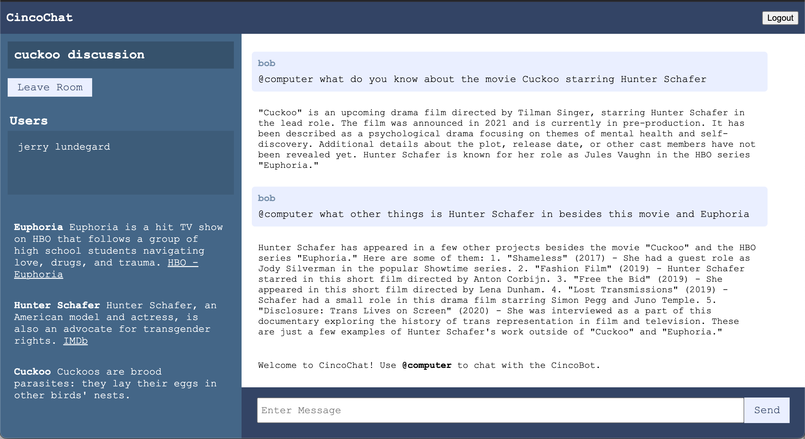

# Group Chat AI Assistant

AI API prompt that generates a JSON response of "factoids" about a list of distinct entities.

[Link to Application](https://portfolio.codethings.net/proxy_loader?link=https://chat.codethings.net)

[Prompt Logic](https://github.com/kirinmurphy/node-sandbox/blob/master/app/chatbot/cincoBot/getMentionedEntityPrePrompt.js)

## Test Scenarios

For each version update, verify prompt by conducting organic conversation and ensuring context is preserved correctly across numerous messages.

## Current Challenges

- We are deduping within a message but need to de-dupe against existing factoid.
- Sometimes factoids are not particulary interesting
- Reference links not ALWAYS provided.
- Reponses have a high rate of returning formatted as expected, but there are some failures.

## Next Steps

- Find ways to generate more compelling factoids. Some are interesting, but some are super trivial, obvious and not useful.
