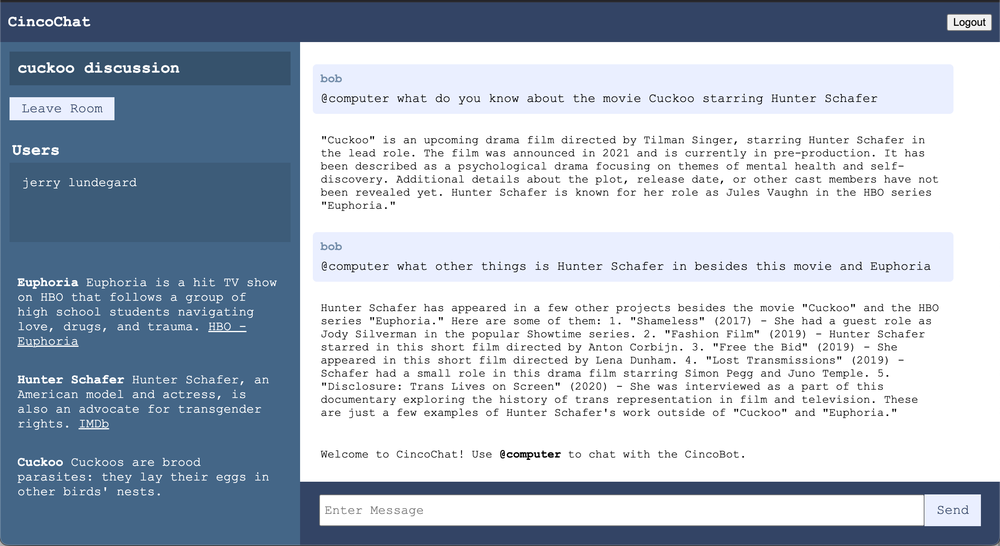

# Group Chat AI Assistant

AI API prompt that generates a JSON response of "factoids" about a list of distinct entities.

[Link to Application](https://portfolio.codethings.net/proxy_loader?link=https://chat.codethings.net)

[Prompt Logic](https://github.com/kirinmurphy/node-sandbox/blob/5e862726cf10e9bf5245a44d23affd89e1578c70/app/chatbot/cincoBot/getCincoBotChatResponse.js)

## Test Scenarios

For each version update, verify prompt by conducting organic conversation and ensuring context is preserved correctly across numerous messages.

## Current Challenges

- Shifting context over a conversation thread can cause the BOT to lose it's frame of reference.

## Next Steps

- Replace default model and test chat against multiple other models
