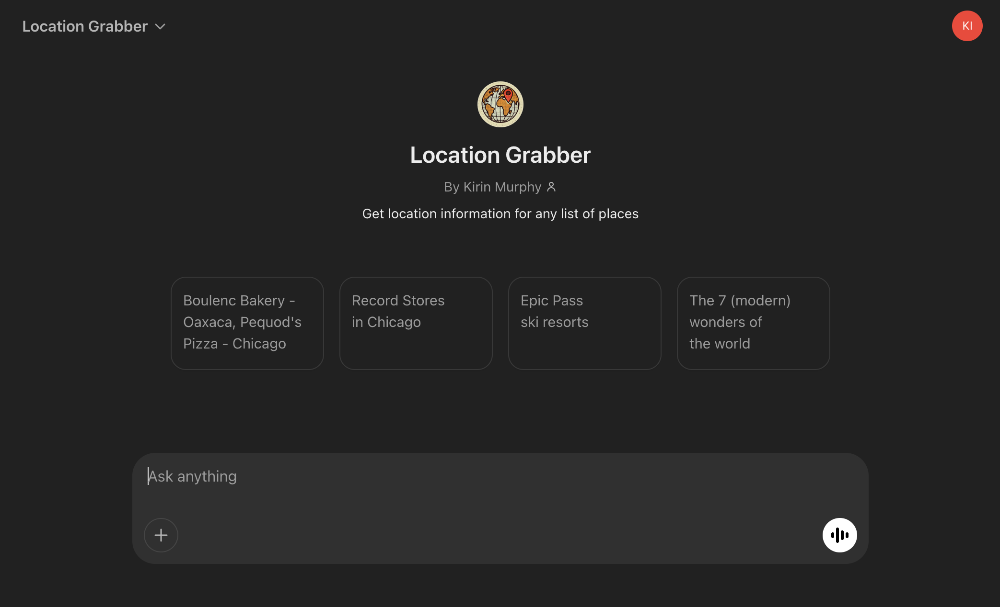
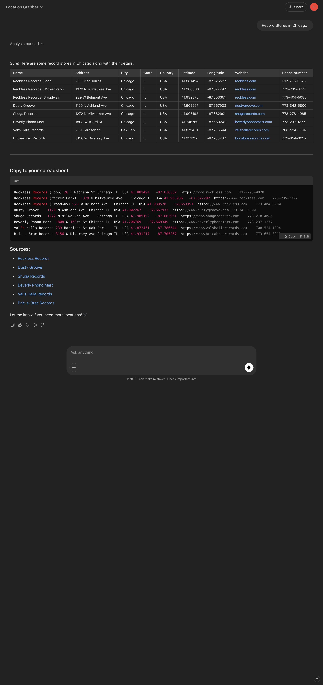

# Location Grabber

Custom GPT that scrapes the web for location information for any list of places.

[Link to GPT](https://chatgpt.com/g/g-kJ2i1rFDl-location-grabber)

[System Prompt](./system_prompt.xml)

## Test Scenarios

For each version update, verify prompt with the 4 conversation starters displayed in the prompt landing page.

## Current Challenges

- On a rare occasion, Lat/Log is not provided.

## Next Steps

- Compel AI to look for lat/long if it doesn't come back initially.
- Verify code snippet works across different spreadsheet tools.
