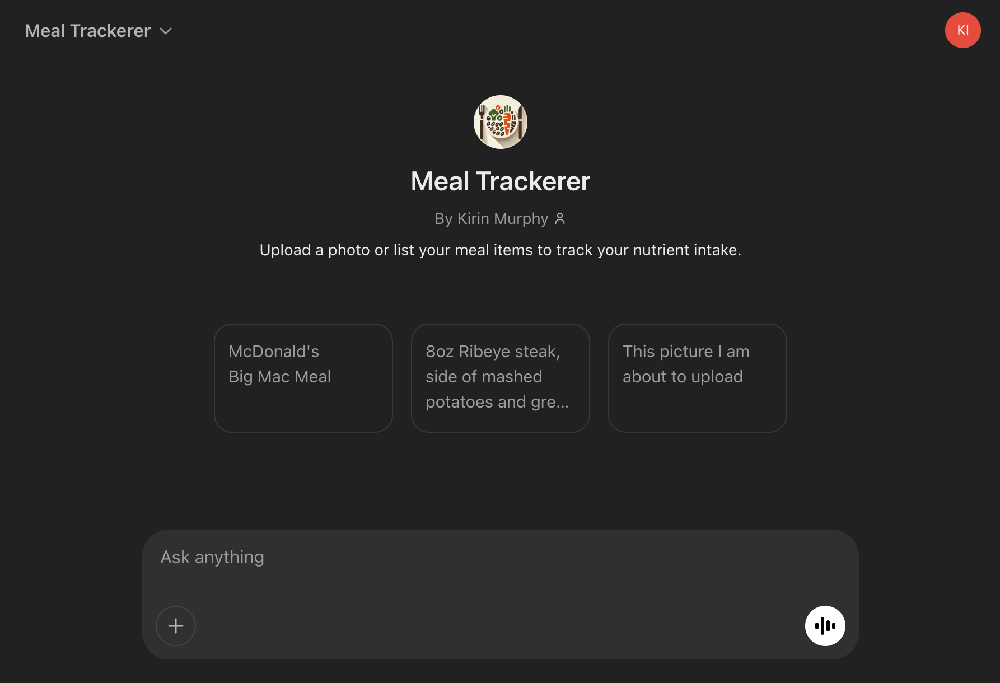
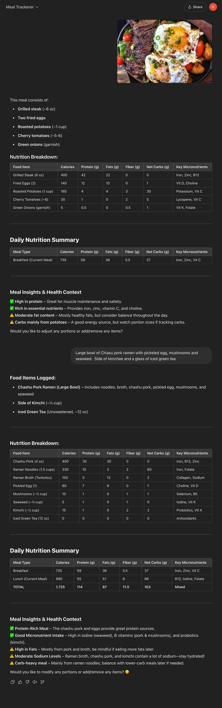

# Meal Trackerer

Custom GPT that tracks your nutrition information across different meals.

[Link to GPT](https://chatgpt.com/g/g-67c49c86d25c8191a877ee9f37cb62cc-meal-trackerer)

[System Prompt](./system_prompt.xml)

## Test Scenarios

For each version update, verify prompt with the follwing test scenarios:

- Messages
  - Message with no meal information
  - Recognized meal from known restaurant (Big Mac Meal)
  - Meal description with portion sizes
  - Meal description with no portion sizes
- Images
  - Image with no meal displayed
  - Image with clearly defined meal
  - Image of a meal that's hard to identify
- Update meal contents after initial analysis
  - Change portion size
  - Change ingredients
  - Remove item
  - Add item to meal
- Add multiple meals
  - Numerous very healthy meals
  - Numerous very unhealthy meals

## Current Challenges

-

## Next Steps

- add a weekly summary table
- In Daily Tracking table, change label for meal from meal type (breakfast, Dinner, etc.) to a short description of the meal.
