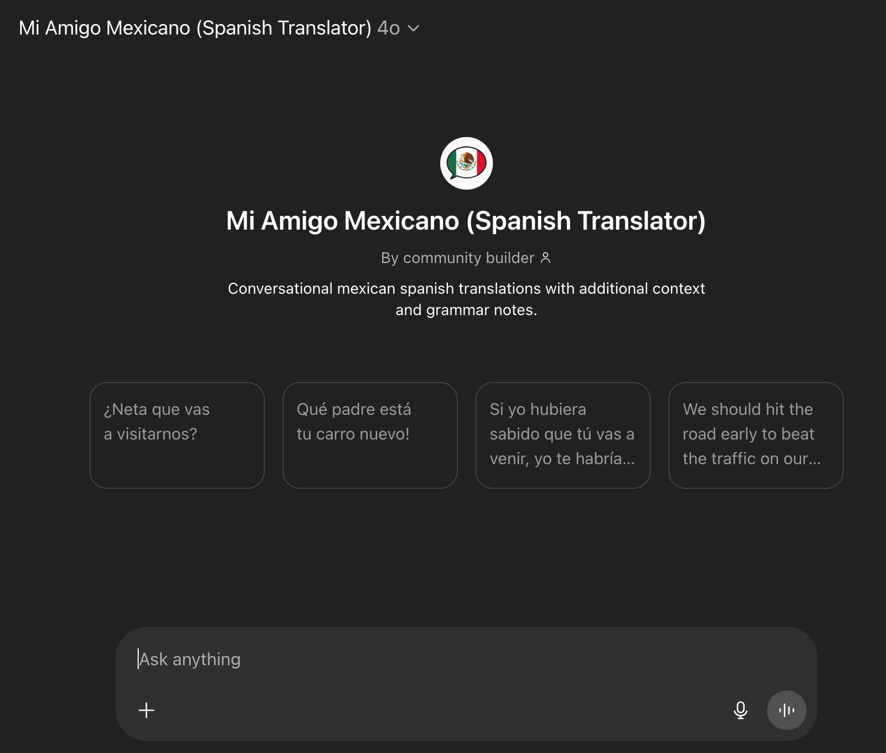
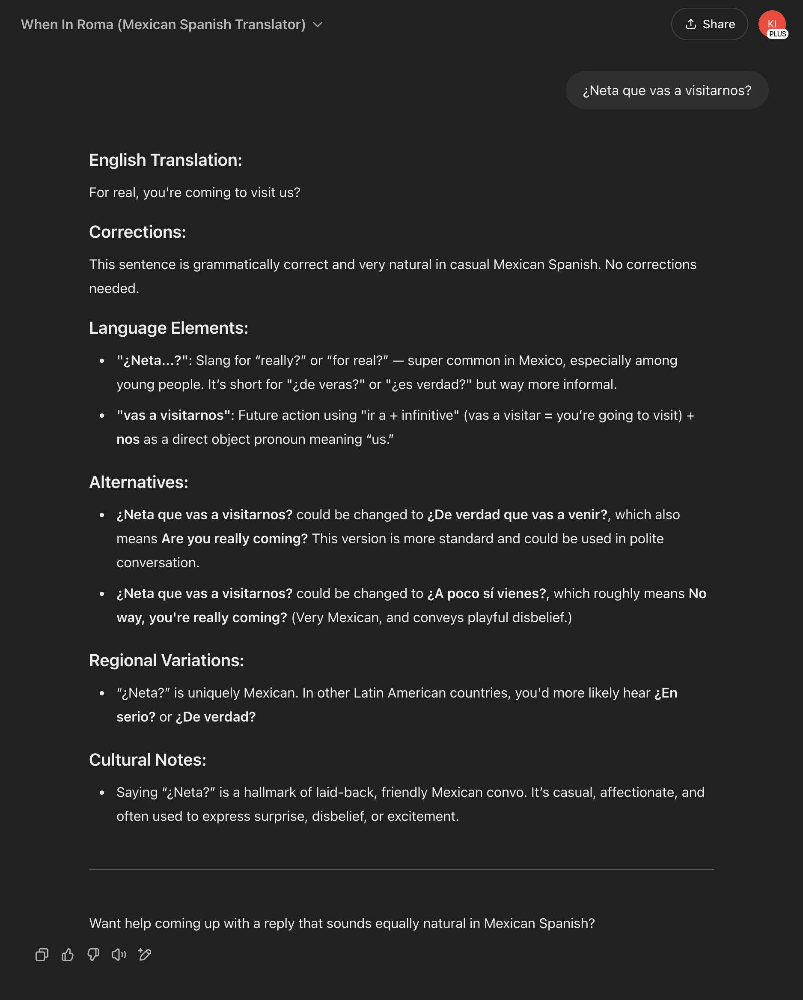
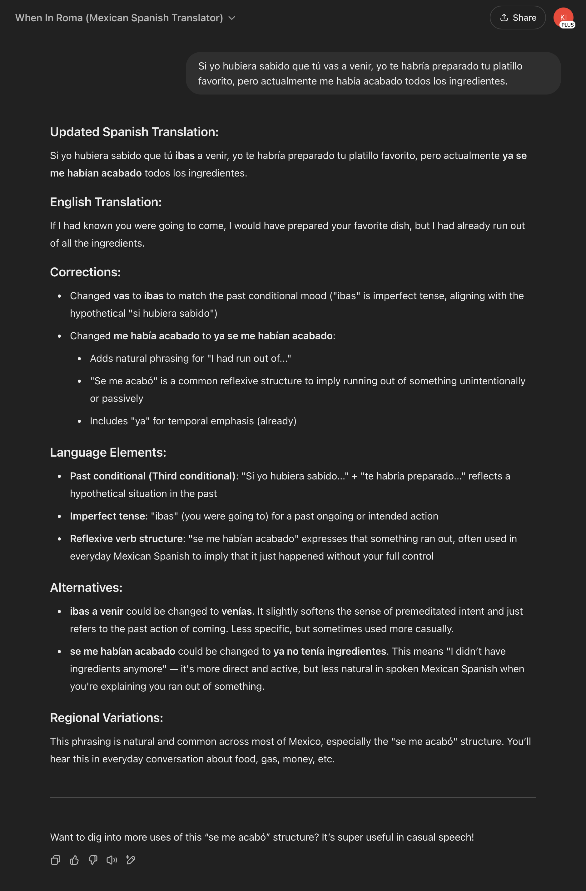
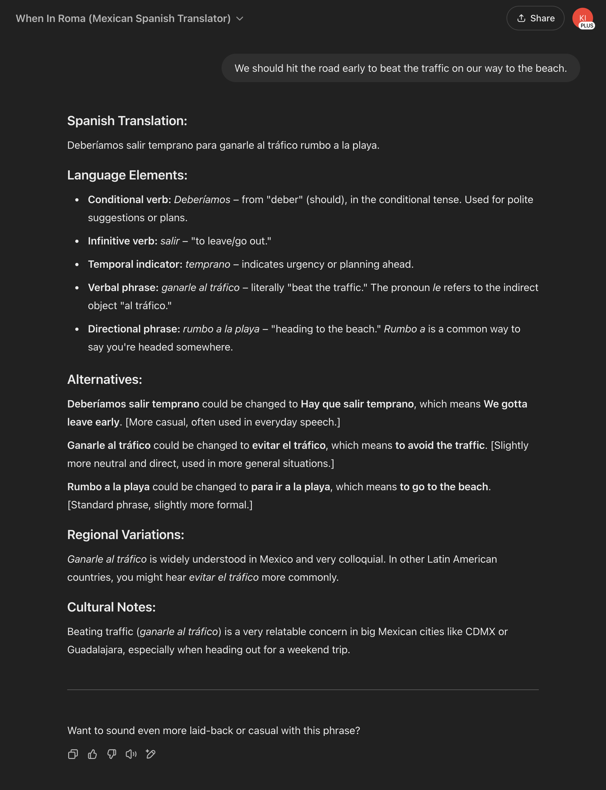

# Mi Amigo Mexicano (Spanish Translator)

Conversational mexican spanish translations with additional context and grammar notes.

[Link to GPT](https://chatgpt.com/g/g-67dd8d76728c81919f23713d68436e30-mi-amigo-mexicano-spanish-translator)

[System Prompt](./system_prompt.xml)

[Meta-Prompting chat in claude project](https://claude.ai/share/df913148-3f23-4fc6-ba97-50f6c533c845)

#### Spanish > English translation with no corrections

#### Spanish > English translation with corrections

#### English > Spanish translation

## Test Scenarios

For each version update, verify prompt with the follwing test scenarios:

- Provide several complex spanish phrases that require corrections/updates
- Provide several complex spanish phrases that need no corrections
- Provide several complex english phrases
- Create versions that can be reused for each prompt for consistency)

## Current Challenges and Next Steps

- Prompt is WAY TOO BIG. Exploring implementation of vector database embeddings and offloading of elements of the query away from the system prompt.

- Numerous references to preserving slang, which are sometimes still ignored in the first custom prompt. Need to refine the redundant instructions down to a limited set that can enforce the rules effectively.

- Corrections should include the specific english translation for the text segment.

- Corrections: if none, force an explicit "None"
