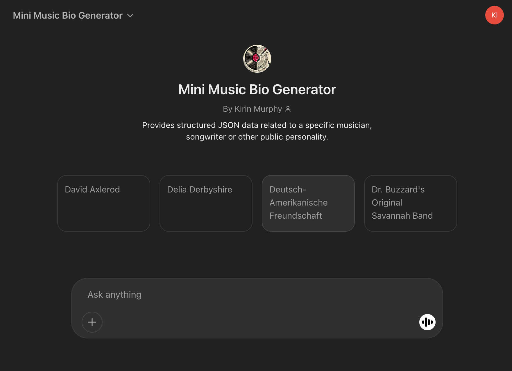
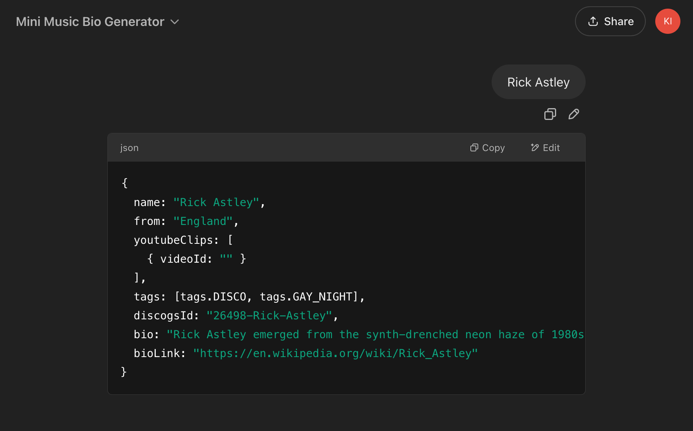

# Mini Music Bio Generator

Scrape data about a musician from the web and return as structured JSON. Built for a specific web project (not general purpose).

[Link to GPT](https://chatgpt.com/g/g-7pmJtsBms-mini-bio-generator)

[System Prompt](./system_prompt.xml)

## Test Scenarios

For each version update, verify prompt with:

- The conversation starters displayed in the prompt landing page.
- An artist name that may be ambiguous or unknown.

## Challenges / Next Steps

- Add additional rules to handle a custom response if the artist/personality name is ambiguous or unknown.
