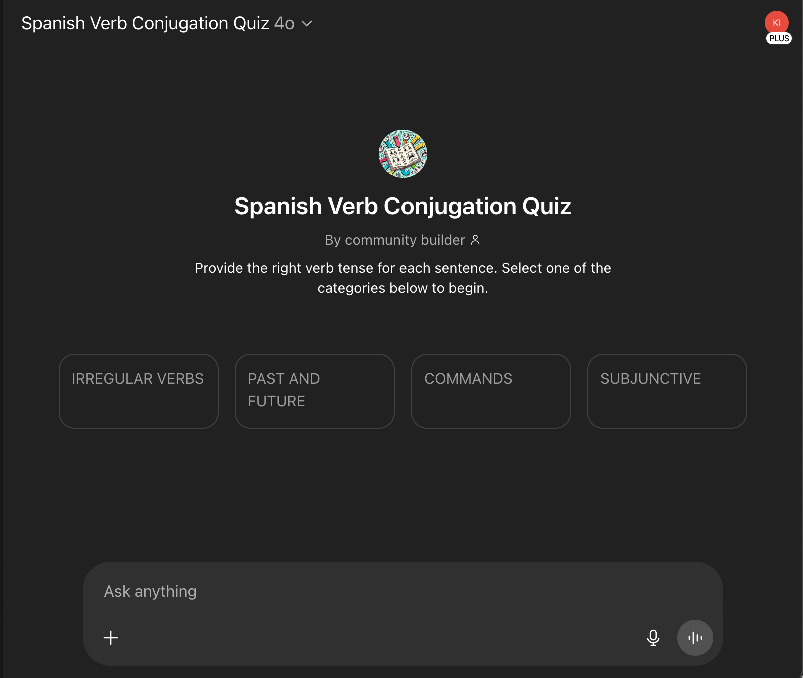
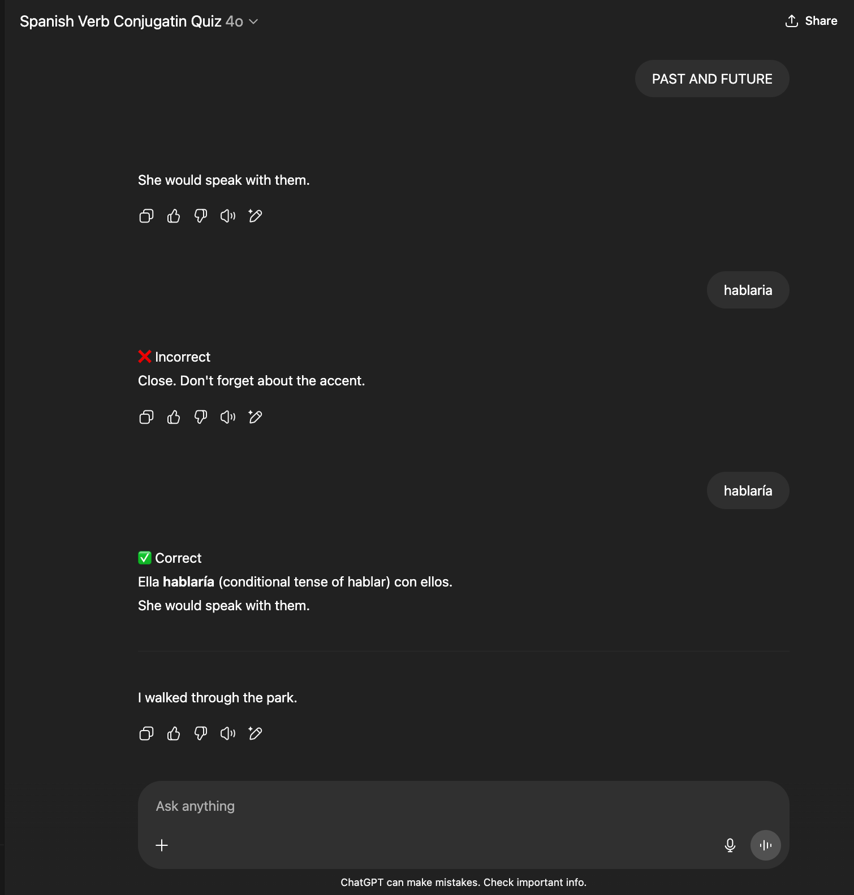

# Spanish Verb Conjugation Quiz

Practice translating spanish verb conjugations.

[Link to GPT](https://chatgpt.com/g/g-686a06a775dc8191b0260e2784dad28c-spanish-verb-conjugatin-quiz)

[System Prompt](./system_prompt.xml)

#### Quiz Example

## Test Scenarios

For each version update, verify prompt with the follwing test scenarios. For each category, answer prompt with:

- correct verb
- incorrect verb once
- incorrect verb twice
- correct verb minus the accent mark
- correct verb with a misplaced accent mark

## Current Challenges and Next Steps

- On a rare occasion there is no prompt to try again on an incorrect answer

- The missing accent warning is applied whether an accent is missing (correctly), or an accent is applied when not needed (incorrectly). Need to change messaging to be more generic.

- The quiz often starts with the same verb
