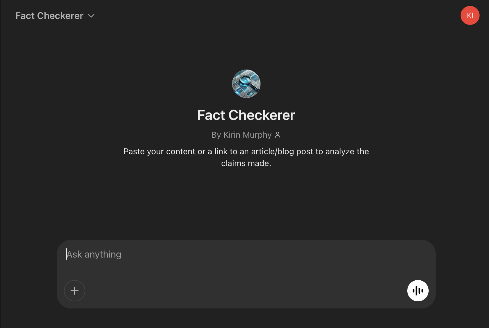
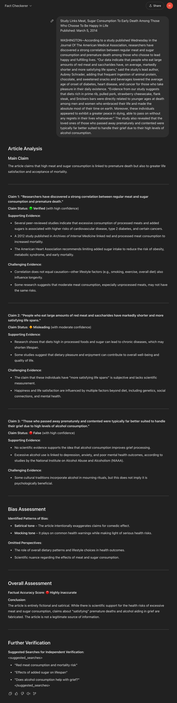

# Fact Checkerer

Custom GPT to analyze claims in a piece of content and provide support/challenges to those claims.

[Link to GPT](https://chatgpt.com/g/g-67cdd9a818748191afdfef28f6bcd343-fact-checkerer)

[System Prompt](./system_prompt.xml)

## Test Scenarios

For each version update, verify prompt with the follwing test scenarios:

- Links
  - Link to article/blog post that can't be read
  - Link to article/blog post that can be read
- Pasted content
  - Content with highly contested claims
  - Content with largely agreed upon claims.

## Current Challenges

- Citations of information used in analysis is inconsistently returned.
- Some responses verify if a quote was made correctly, but not assess the veracity of that quote.

## Next Steps

- Add direct attributions/quotes to back supporting/contracdicting evidence.
- Improve consistency of citations for content used in assessment
- Explain to user why the claim assessment has a high/medium/low confiedence of response
- Provide follow up prompts after response:
  - "Would you like me to look for and analyze more claims within the article?"
  - "Would you like me to expand on any of the analysis I have provided?"
